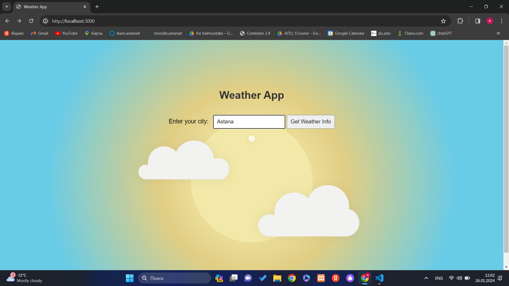
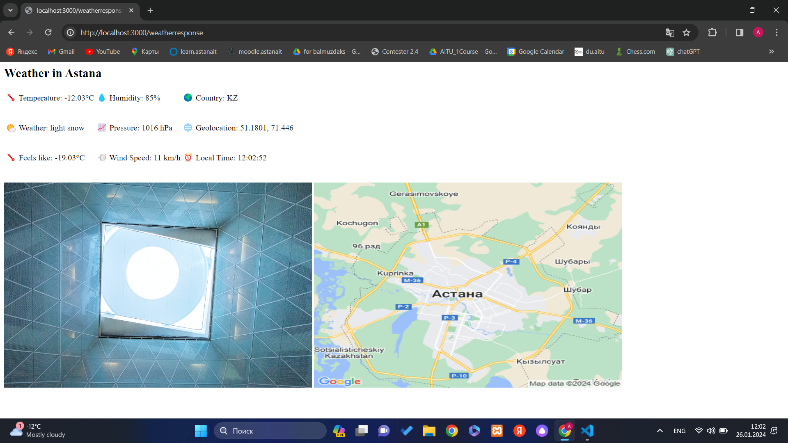

# Weather App

This is a simple weather app that provides weather information for a given city.

## Prerequisites

- Node.js installed on your machine.

## Getting Started

**Clone Repository:**
   ```bash
   git clone <repository-url>
   cd weather-app

## Install Dependencies:

npm install express body-parser axios

## Obtain API Keys:

Get your OpenWeatherMap API key.
Get your Unsplash API key.

## Run the App:

bash
Copy code
npm start


## Access the App:

Open your browser and go to http://localhost:3000 to access the weather app.





## Usage

Search for Weather:

Enter a city name in the search box and click "Get Weather Info."
View Weather Information:

The app will display weather information, including temperature, weather description, and more.
Background Photo and Map:

The app uses a background photo and displays a map using Leaflet. Ensure a reliable internet connection for map data.
Troubleshooting:

If you encounter issues, check the console for error messages. Verify API keys and ensure the correct installation of dependencies.

## Notes

Map functionality may require additional configuration if issues persist.
The app uses Leaflet for maps. If you encounter issues, consider alternatives or additional configurations.